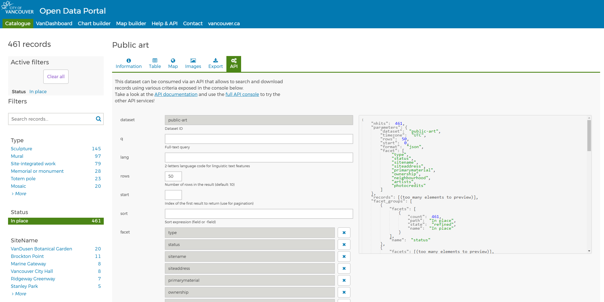

```{r setup, include=FALSE}
knitr::opts_chunk$set(echo = TRUE)
```

This code is inspired by Aetaka Shashank's instructional material https://aticup.github.io/webmapr/

## Exploring Vancouver Open Data Portal

In this report we will explore an open data set using Vancouver's Open Data Portal <https://opendata.vancouver.ca/explore/dataset/public-art/information/?rows=50&refine.status=In+place&location=13,49.28936,-123.05022>.

This package contains information on the location of public art and corresponding artist(s) in the City.



We will select 50 rows, with the condition "Status" "In place" and then export to CSV.
We save the file as "public-art.csv", a file with ";" as separators. Ensure your CSV file is saved within your working directory if executing the code exactly as is here. 

## Exploring the data

We will begin by importing the following libraries:

(Note: remember to install packages via the install.packages("library_name")) command!)


```{r packages, echo = T, results = 'hide',warning=FALSE,message=FALSE}
library(leaflet)
library(magrittr)
library(jsonlite)
library(tidyverse)
library(tidyjson)
library(sf)
```

Let's read the data. 

```{r read data, echo = T,warning=FALSE,message=FALSE}

# Read art data
art_data <- read.csv("public-art.csv",sep=";")
glimpse(art_data)
```

To generate a map with the locations of art pieces in Vancouver, we need coordinates. The Geom column contains this information. Let's first see if there are any empty entries under Geom. 


```{r count empty Geom entries, echo = T,warning=FALSE,message=FALSE}

# Look for NA or entries with an empty string under Geom
length(art_data[(is.na(art_data$Geom) | art_data$Geom==""), ]$Geom)
```

It looks like there are 61 rows in the dataframe such that the Geom column is either empty
or contains an empty string. Let's subset the data to get only non-empty entries. 

```{r subset data, echo = T,warning=FALSE,message=FALSE}

# Clean data
# Remove "" entries in art_data
art_data <- art_data[!(is.na(art_data$Geom) | art_data$Geom==""), ]

```

Let's select the first three items within the Geom column. 

```{r geom column, echo = T,warning=FALSE,message=FALSE}

# Clean data
# Remove "" entries in art_data
art_data$Geom[1:3]

```

When we try to access coordinates within Geom, we see they are stored within an object of type JSON. Let's clean up. 

```{r flatten data, echo = T,warning=FALSE,message=FALSE}
# "Flatten" column Geom
geom_dat <- art_data$Geom %>% # Select Geom column
  map_dfr(~ fromJSON(.x) %>%  # Format entries in JSON format
            as.data.frame) # Transform to dataframe format

# Ensure correct data structure
geom_dat <- as.vector(geom_dat)

# Generate latitude and longitude
art_data$latitude <-geom_dat$coordinates[seq(2,800,2)]
art_data$longitude <-geom_dat$coordinates[seq(1,800,2)]

# Latitude and longitude of first data point
print(c(art_data$latitude[1],art_data$longitude[1]))
```

## Generating our first map 

Let's use these coordinates to generate our first map. 

```{r map1, echo = T,warning=FALSE,message=FALSE}
# Generate our first map using coordinates
map_1 <- leaflet() %>% # Creates leaflet map widget
  addTiles() %>% # Adds default OpenStreetMap tiles
  addMarkers(lng = art_data$longitude[1], # Select first long coordinate
             lat = art_data$latitude[1], # Select first lat coordinate
             popup = art_data$URL) # Add pop up with URL info

map_1
```

Clicking on the popup reveals a [URL](https://covapp.vancouver.ca/PublicArtRegistry/ArtworkDetail.aspx?ArtworkId=857) with information about a mural titled Flow Tide, by Shion Skye Carter and Kisyuu.


Let's visualize all data points in the CSV by generalizing the code above. 

We will also customize the pop ups. 

```{r map2, echo = T,warning=FALSE,message=FALSE}
# Generate plot
map2 <- leaflet() %>%  # Creates leaflet map widget 
  addProviderTiles(providers$CartoDB.Voyager) %>% # Select base map
  setView(-123.12402, 49.2474, zoom = 12) %>%  # Set view and zoom level
  addCircleMarkers(data = art_data,  # adding data points from art_data set
                   lat = art_data$latitude,  # include latitude and longitude
                   lng = art_data$longitude,
                   color = "black", fill = TRUE, opacity = 1, # format datapoint
                   radius = 2, weight = 1,
                   popup = paste("Year of Installation:", art_data$YearOfInstallation, "<br>", # add pop up info
                                 "URL:", art_data$URL, "<br>"))
map2

```

## Are there neighborhoods within Vancouver where more pieces of art are concentrated than  others?

Let's take a look at the neighborhoods in Vancouver. We will import a shapefile to generate an interactive map with those neighborhoods. 

Shapefile obtained via the [Vancouver Open Data Portal](https://opendata.vancouver.ca/explore/dataset/local-area-boundary/information/?location=13,49.2474,-123.12402)

```{r shape , echo = T,warning=FALSE,message=FALSE}

# Adding local area boundary
nbh <- st_read("local-area/local-area-boundary.shp")
van <- leaflet() %>%
  addProviderTiles(providers$CartoDB.Voyager) %>%
  setView(-123.12402, 49.2474, zoom = 12) %>%
  addPolygons(data = nbh, color = "#444444", weight = 1, smoothFactor = 0.5,
              opacity = 1.0, fillOpacity = 0.3,
              fillColor = "brown",
              highlightOptions = highlightOptions(color = "white",
                                                  weight = 2,
                                                  bringToFront = TRUE),
               popup = paste("Neighborhood: ", nbh$name, "<br>"))
van

```

We can then add the pop ups with the art locations. 

```{r together, echo = T,warning=FALSE,message=FALSE}
# Bringing it all together
van2 <- leaflet() %>%
  addProviderTiles(providers$CartoDB.Voyager) %>%
  setView(-123.12402, 49.2474, zoom = 12) %>%
  addPolygons(data = nbh, color = "#444444", weight = 1, smoothFactor = 0.5,
              opacity = 1.0, fillOpacity = 0.3,
              fillColor = "brown",
              highlightOptions = highlightOptions(color = "white",
                                                  weight = 2,
                                                  bringToFront = TRUE),
               popup = paste("Neighborhood: ", nbh$name, "<br>")) %>%
  addCircleMarkers(data = art_data, 
                   lat = art_data$latitude, 
                   lng = art_data$longitude,
                   color = "black", fill = TRUE, opacity = 1,
                   radius = 2, weight = 1,
                   popup = paste("Year of Installation:", art_data$YearOfInstallation, "<br>",
                                 "URL:", art_data$URL, "<br>"))
van2

```

## What neighborhood has the most pieces of art?

It looks like the Downtown area has the most art. Can we confirm this using R?

We will need to compute the intersection between the polygons (neighborhoods) and the data points (art location).

```{r counting,echo = T,warning=FALSE,message=FALSE}

# Select longitude and latitude using coordinate reference system
# WGS84 (EPSG: 4326)
## Commonly used by organizations that provide GIS data for the entire globe or many countries. CRS used by Google Earth

dsf <- sf::st_as_sf(art_data, coords=c("longitude","latitude"), crs=4326)

# Convert foreign object to an sf object
map <- sf::st_as_sf(nbh)
# Transform into CRS 4326 - matching CRS as data point
map <- st_transform(map,crs=4326)

# Plot for visual reference, uses sf::plot_sf:
plot(map, reset=FALSE)
plot(dsf, add=TRUE, reset=FALSE, pch=16, col="red", cex=0.5)
axis(1, line=-1) ; axis(2, line=-1, las=1)

# Find country of each coordinate:
# 2163
int <- st_intersection(map, dsf)

# Compute frequency 
frequency <- as.data.frame(table(int$name))
colnames(frequency) <- c("Neighborhood", "ArtFrequency")

# Sort in descending order
frequency[order(-frequency$ArtFrequency),]
```

It looks like the Downtown area has the most art! 
